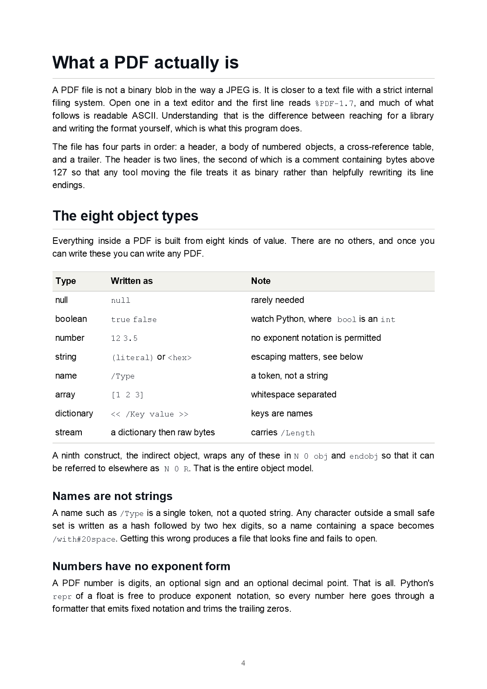

# inkless

Turns a Markdown file into a properly typeset PDF, with the PDF format
written out byte by byte from one Python file. No ink, no dependencies:
standard library only, nothing to install, no HTML in the middle, no font
files, no shelling out to a converter.

## A generated example



That is page 4 of **[examples/paper.pdf](examples/paper.pdf)**, a 12 page
document with a title page, a two page clickable table of contents,
justified body text, tables, code panels and outline bookmarks.

The picture is rasterised from the same layout data the PDF writer uses,
because there is no PDF rasteriser in the Python standard library and this
repository will not add one. Open the PDF itself to see the real thing.

Other committed output, openable without running anything:

| File | What it shows |
|:--|:--|
| [examples/paper.pdf](examples/paper.pdf) | The flagship. Title page, clickable contents, bookmarks, justified text |
| [examples/blocks.pdf](examples/blocks.pdf) | Every block and inline construct, flat and nested |
| [examples/ugly.pdf](examples/ugly.pdf) | Deliberately hostile input: six level nesting, wide tables, unbreakable strings, tabs, parentheses and backslashes, embedded PNGs, broken image references |
| [examples/hello.pdf](examples/hello.pdf) | The smallest thing that works: one page, six objects, a hand written xref |

`hello.pdf` is the only one not produced by the command line tool. It was
written directly against the PDF writer as the first checkpoint of this
project, before any layout code existed, to prove the cross-reference table
was right before anything was built on top of it. It is kept because six
objects is a readable size: open it in a text editor and the whole format is
visible at once.

## Install

Requires Python 3.10 or newer. There is nothing to install.

```
git clone <this repo>
cd inkless
python inkless.py examples/paper.md -o paper.pdf --toc --justify
```

`requirements.txt` exists and is zero bytes. That is not an oversight.

## Usage

```
inkless INPUT.md [-o OUTPUT.pdf]
  --page-size {a4,letter}    page size (default: a4)
  --font {helvetica,times,courier}
  --font-size N              body size in points (default: 11)
  --margin N                 page margin in points (default: 64)
  --toc                      clickable table of contents plus bookmarks
  --justify                  justify body text to both margins
  --no-page-numbers          leave the footer empty
  --date YYYY-MM-DD          pin the metadata date for reproducible output
  --check                    parse and report problems, write no PDF
  --version
```

`INPUT.md` may be `-` to read standard input, in which case `-o` is required
and images cannot be resolved.

Real output, pasted from a run:

```
$ python inkless.py examples/paper.md -o paper.pdf --toc --justify
inkless: wrote paper.pdf (12 pages, 45412 bytes)

$ cat requirements.txt

$ python inkless.py examples/blocks.md --check
inkless: no problems found in examples/blocks.md
$ echo $?
0
```

`--check` exits non-zero if anything is wrong, so it works as a CI gate. Every
diagnostic points at an exact position with a caret:

```
$ python inkless.py examples/ugly.md --check
Warning: unclosed emphasis
  Unclosed, which warns: **this bold never closes and the parser has to cope
                         ^
  at line 162, column 24
```

Colour is used on the diagnostics only when standard error is a terminal and
`NO_COLOR` is unset.

## How it works

The pipeline is: scan the Markdown, parse it to a tree, measure the text,
break it into lines, place the lines on pages, then write the PDF.

### What a PDF actually is

A PDF is not a binary blob the way a JPEG is. It is closer to a text file
with a strict internal filing system, and much of it is readable ASCII. It
has four parts in order: a two line header, a body of numbered objects, a
cross-reference table, and a trailer.

Everything inside is built from eight kinds of value and nothing else: null,
boolean, number, string, name, array, dictionary and stream. A ninth
construct, the indirect object, wraps any of them in `N 0 obj ... endobj` so
it can be referenced elsewhere as `N 0 R`. Once you can write those, you can
write any PDF, which is what `Section 10` of `inkless.py` does.

Text is drawn by a small stack of postfix operators inside a content stream:
`BT` opens a text object, `/F1 12 Tf` selects a font at a size,
`1 0 0 1 72 720 Tm` sets the position, `(Hello) Tj` shows a string, `ET`
closes it. Rectangles for rules, code panels and table shading are
`x y w h re f`. Content streams are zlib compressed and declared
`/Filter /FlateDecode`.

### Why the standard 14 fonts mean no font embedding

Every conforming PDF reader is **required** to provide fourteen fonts
itself: Helvetica, Times and Courier in four cuts each, plus Symbol and
ZapfDingbats. A file that names only those never has to embed a glyph, which
is the whole reason a zero dependency typesetter is possible at all.

The catch is that line breaking happens here, in the writer, long before any
reader sees the file. So the writer still needs to know how wide every
character is. Those advance widths are published as part of the font
metrics, in units of 1/1000 em, and `inkless.py` hard-codes them for codes 32
to 126 across all twelve text cuts. Measuring is then arithmetic: add the
advances, multiply by the point size, divide by 1000.

Two details worth knowing. The oblique and italic cuts are slanted versions
of the same outlines and carry identical widths, so they share tables. And an
accented glyph such as `Aacute` is composed from a base letter and a floating
accent, so it advances exactly as far as `A`; deriving accented widths that
way is exact rather than invented.

### How the xref byte offsets work, and why one byte kills the file

The cross-reference table lists the byte offset of every object in the file.
Not an index, not a name: the literal number of bytes from the start of the
file to the first character of that object's header.

```
xref
0 7
0000000000 65535 f
0000000015 00000 n
0000000064 00000 n
```

Each entry is exactly twenty bytes: ten digits of offset, a space, five
digits of generation, a space, a one letter type flag, and a two byte line
ending. Object zero is always the head of the free list at generation 65535.
The trailer names the root object and the total count, and `startxref` gives
the byte offset of the table itself, so a reader starts at the end of the
file and works backwards without reading the middle.

Get an offset wrong by a single byte and every conforming reader rejects the
whole document. There is no partial credit. That forces a shape on the
writer: you cannot stream a PDF out and patch it later without seeking, so
inkless builds the entire file in one buffer and records each object's
position as it is appended. `PdfWriter.render` is the only function allowed
to write into that buffer.

The test suite carries a small PDF reader that re-derives the table from the
finished bytes and checks that every offset lands on the object header it
claims to point at. Two further tests corrupt a file on purpose, shifting one
offset by a single byte, to prove that the checker would actually notice.

### How widow and orphan control works

Anyone can stack lines until a page is full. The difference between output
that looks typeset and output that looks dumped is what happens at the
boundary. An **orphan** is the first line of a paragraph left alone at the
foot of a page; a **widow** is the last line left alone at the head of the
next one.

inkless expresses both with a single mechanism. The document is rendered to a
flat list of rows, and any row can be marked *keep with next*. The paginator
refuses to end a page on a marked row and pushes the whole chain forward.

- The first line of a multi-line paragraph is kept with the next, so it
  cannot be stranded at the bottom.
- The second to last line is kept with the next, so the last line cannot be
  stranded at the top.
- A heading is kept with whatever follows it, so a heading never ends a page.

A three line paragraph therefore moves as a unit, because there is no way to
split it that does not strand something. Trimming trailing blank space and
pulling kept chains alternate until neither applies, because removing a space
row can expose a kept row underneath it.

Rows are flat rather than a nested box tree on purpose. A blockquote that
crosses a page boundary has to draw its rule on both pages and a code listing
that crosses one has to paint its panel on both, so every row carries its own
decorations and that falls out of pagination instead of needing a repair
pass.

### How the two-pass table of contents converges

To print a contents page you need to know which page each heading is on. To
know that you need the final pagination. But inserting the contents shifts
every page after it, which changes the numbers you were about to print. One
extra pass is the obvious fix and it is **not sufficient**: if the contents
grows from one page to two during resolution, every number it already printed
is short by one.

The body is paginated exactly once, because nothing placed before it changes
where its own breaks fall. Only the offset added to its page numbers is in
question, and that offset is the length of the contents itself. So the loop
guesses one page, lays the contents out, and if it needed more, raises the
guess and tries again.

That loop cannot oscillate, because it is monotone: a larger offset can only
make a printed number wider, which can only narrow the space left for a
title, which can only produce the same number of lines or more. Rising
guesses converge. It stops as soon as a pass fits inside its own guess; if a
pass ever comes out shorter, the contents are padded so the printed numbers
stay true; and a hard bound of eight passes stops any pathological document
spinning, emitting a warning rather than quietly wrong numbers.

`examples/paper.md` exercises this for real: its contents grows to two pages,
so it takes two passes.

Destinations carry the heading's actual vertical position, not just its page.
An entry that jumps to the top of the right page is still wrong if the
heading is two thirds of the way down it.

### Why there are no regular expressions

`inkless.py` never imports `re`. The Markdown parser scans character by
character with index arithmetic.

The reason is not purity. A regular expression matches a span and hands back
the span; it does not naturally hand back the byte offset, line and column of
every token inside it. Scanning by index gives those for free, and they are
what turns a vague complaint into a caret under the exact character that
caused it. Every node in the tree carries the offset, line and column of the
character that produced it, built in from the first line of the scanner
rather than retrofitted.

Emphasis in particular is harder than it looks. Pairing each asterisk with
the next one falls over on `***bold italic***`, on `a*b*c*d*e`, on bold nested
inside a link label, and on `snake_case_identifiers` that must survive
unmangled. inkless uses a delimiter stack with the CommonMark flanking rules,
including the rule that a pair whose lengths sum to a multiple of three is
rejected unless both are themselves multiples of three.

### Images

PNG only, 8 bit, RGB or RGBA, not interlaced, and only when the image is
alone on its line. There is a pleasant coincidence in the format: PDF's
FlateDecode filter understands the same per-scanline predictors PNG uses, so
a truecolour PNG is handed straight through with `/Predictor 15` and the
reader undoes the filtering. Only RGBA has to be decoded here, because PDF
keeps transparency in a separate `/SMask` and the two channels have to be
pulled apart.

Anything else is refused with a warning naming the file and the line it was
written on, and the alt text is set instead. A document never ends up with a
corrupt image in it.

## Reproducible builds

The same input and flags produce byte identical output. No timestamp is ever
read: the date comes from the front matter, from `--date`, or from a fixed
default, and the test suite walks the syntax tree of the program and fails
the build if any call to a clock function appears anywhere in it. The
trailer's `/ID` is a digest of the objects themselves, so it is stable across
runs while still changing whenever the content does. Every mapping that
reaches the file is an ordered dictionary built in a fixed sequence.

Two actual runs, on Python 3.14.7:

```
$ python inkless.py examples/paper.md -o a.pdf --date 2026-01-01
inkless: wrote a.pdf (10 pages, 24570 bytes)
$ python inkless.py examples/paper.md -o b.pdf --date 2026-01-01
inkless: wrote b.pdf (10 pages, 24570 bytes)
$ sha256sum a.pdf b.pdf
b25cf5d6134ce18d47b93c1791a55e562223b07f082a93e5ed6eb667ece0e51b *a.pdf
b25cf5d6134ce18d47b93c1791a55e562223b07f082a93e5ed6eb667ece0e51b *b.pdf
```

Committed example hashes, all built with `--date 2026-01-01` on 3.14.7:

| File | sha256 |
|:--|:--|
| `examples/paper.pdf` | `992d1e35aa57b0b5fc1558f640b1ab1b19e2144642bb5d22d4eec22d9dd7b5ad` |
| `examples/blocks.pdf` | `8fe9d01b01fe48c2c6dbd34ace6ece3747e75e32548324c565b5e873f7d4f1fc` |
| `examples/ugly.pdf` | `ba923d5c6f69c1f0a6dace7d529dedea6da5db48ffbbe2064d1e1bca22b201a8` |
| `examples/hello.pdf` | `22912eb1a155aaccd18622ac9c8e5d895607ad68a2fdba3019e0a70b3fbd8e84` |

**One honest boundary on that claim.** Determinism holds for a given Python
build. It does **not** hold across zlib implementations: Python 3.14 ships
zlib-ng 1.3.1 and Python 3.10 ships zlib 1.2.13, and the two produce
different, equally valid deflate streams for the same input. Building
`examples/paper.md` on 3.10 gives 45218 bytes against 45412 on 3.14.

This is compression only, not layout. With stream compression disabled, both
interpreters produce a byte identical file,
`4f4cd16bfd3cfac5f8765a7116046ea2cd5a596363586b368f4c38bc9b801d0d`, which is
the evidence that everything inkless itself decides is reproducible. The
hashes above are therefore reproducible on Python 3.14; pin the interpreter
if you need to reproduce them exactly.

## Honest limits

Real ones, not a token list.

**Typesetting**

- **Greedy line breaking, not Knuth-Plass.** Lines are filled first-fit. TeX
  considers the paragraph as a whole and minimises total badness, which is
  visibly better, especially justified. Some justified lines here have looser
  word spacing than a total-fit algorithm would leave them.
- **No hyphenation.** A word wider than the column is broken by width with no
  hyphen inserted, because there is no hyphenation dictionary and a hyphen
  would imply a syllable boundary that has not been checked. This is most
  visible in a narrow table column, where a header word will split across
  lines mid-word: `Colum` then `n four`. That is the intended behaviour
  rather than a layout failure, but it is the ugliest thing the line breaker
  does, and `examples/ugly.pdf` shows it on purpose in the six column table.
- **Shared baseline ratios.** One ascent/descent pair (0.72 and 0.21) places
  every baseline, rather than per-font values. Helvetica ascends 0.718 and
  Times 0.683, so a line mixing families sits on one baseline by choice; it
  is not exactly either font's own metric.
- **No footnotes, no math, no raw HTML, no setext headings.** A `---`
  underline is a thematic break here, not a heading.

**Fonts and text**

- **No font embedding, so no CJK, Greek, Cyrillic, Hebrew or emoji.** Only
  what WinAnsiEncoding covers can be drawn. Anything else becomes `?` and is
  reported once per distinct character with its exact line and column.
  Nothing is ever dropped silently.
- **Widths above code 126 are partly derived, not tabulated.** The hard-coded
  tables cover codes 32 to 126 exactly. Above that, accented letters take
  their unaccented base letter's width, which is exact for these fonts
  because the glyphs are composed; a handful of punctuation widths are
  spelled out; and anything else falls back to the width of a digit. That
  last case is an approximation and is documented here rather than guessed at
  in the table.

**Images**

- PNG only. 8 bit only, so no 16 bit samples. RGB and RGBA only, so no
  palette, greyscale, or greyscale with alpha. No interlacing.
- Only an image alone on its own line is embedded. An image inline in a
  sentence would have to sit on a text baseline and take part in line
  breaking; those are shown as alt text with a warning.
- Physical size is assumed at 96 dpi, because PNG only carries pixel counts
  unless a `pHYs` chunk says otherwise, which inkless does not read.

**Other**

- **Slower than reportlab**, which is a mature C-backed library. For
  documents of this size it does not matter, and the trade is deliberate:
  nothing to install, nothing to audit, nothing to break when a transitive
  dependency changes.
- Tables do not repeat their header across a page break, and a single table
  row taller than the page will overflow rather than split.
- No encryption, no forms, no attachments, no tagged PDF or accessibility
  structure.

## Licence

MIT. See [LICENSE](LICENSE).
