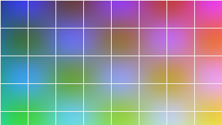
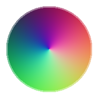

# Hostile input, on purpose

This file exists to be difficult. It is not a showcase, it is a stress test.
Every construct here has broken some renderer somewhere. If the output looks
sane, the edge handling works. Some warnings are raised deliberately; run
`inkless examples/ugly.md --check` to see them with their source positions.

## Punctuation that fights the PDF format

Literal parentheses ( and ) and ) ( unbalanced on purpose, and a backslash \\
and two backslashes \\\\ and a trailing one at the end of this line. \\
Mixed together: (a\\b) \\(c\\) ((d)) )e( \\\\(f)\\\\.

A paragraph made almost entirely of delimiters:
( ) ( ) \\ \\ ( \\ ) ( ) ) ( \\\\ ( ) \\ ( ) ) \\ ( ) ( \\ ) ( ) \\\\ ) ( \\ (

Escaped markup that must stay literal: \\*not bold\\*, \\_not italic\\_,
\\`not code\\`, \\#not a heading, \\[not a link\\](nope), \\!not an image.

## Long unbreakable strings

A word with no spaces at all, which cannot be broken on whitespace and must
be broken by width instead:

Supercalifragilisticexpialidociousantidisestablishmentarianismpneumonoultramicroscopicsilicovolcanoconiosisfloccinaucinihilipilificationhonorificabilitudinitatibus

A path-like string of similar hostility:

/usr/local/share/some/deeply/nested/directory/structure/that/keeps/going/and/going/without/any/break/opportunity/at/all/final.tar.gz

A URL as an autolink: <https://example.org/a/very/long/path/that/goes/on/for/a/while/and/then/some/more?query=parameter&another=value&third=yes>

Inside a code span: `this_is_a_single_token_inside_a_code_span_that_is_far_too_wide_for_the_column_and_must_be_broken`

## Deep nesting

- Level one
  - Level two
    - Level three
      - Level four
        - Level five
          - Level six, which also has a long line that will wrap and must
            keep its indentation while doing so
          - Level six, second item
        - Back to five
      - Back to four
    - Back to three
      1. An ordered list at depth four
      2. Second
         - And unordered again at depth five
           - And once more at six
  - Back to two
- Back to one

Quotes nested inside quotes inside quotes:

> One deep.
>
> > Two deep, with enough text that it wraps onto a second line and shows
> > whether the rules stack correctly.
> >
> > > Three deep.
> > >
> > > > Four deep, which is further than anyone should go.
> >
> > Back to two.
>
> Back to one.

A list inside a quote inside a list:

- Outer item
  > A quote inside the item
  >
  > - A list inside the quote
  >   - Nested again
  >
  > ```
  > and a code block inside the quote inside the list
  >     with indentation
  > ```
- Second outer item

## Tabs

	This line is indented with a single tab and is an indented code block.
	This one too.
		And this one has two tabs.

```
def tabbed():
	return "this fenced block uses tabs for indentation"

def spaced():
    return "and this one uses spaces, at the same visual depth"
```

Mixed	tabs	inside	a	paragraph	should	collapse	to	single	spaces.

## Wide tables

| Column one | Column two | Column three | Column four | Column five | Column six |
|:-----------|:----------:|-------------:|:------------|:-----------:|-----------:|
| short | short | short | short | short | short |
| a much longer cell that has to wrap inside its own column | centred and also fairly long | right aligned and long as well | more text here | and here | and finally here |
| `code_in_a_cell()` | **bold** | *italic* | [a link](https://example.org) | (parens) | back\\slash |
| 1 | 22 | 333 | 4444 | 55555 | 666666 |

A table whose header is much shorter than its body:

| a | b |
|---|---|
| This cell contains a great deal of text, far more than the header suggests, and it will need several lines to fit into the column it has been given | short |

A table with a deliberately mismatched row, which warns:

| x | y | z |
|---|---|---|
| short row |
| kept | kept | kept | DROPPED |

## Images

A truecolour PNG, embedded:



An RGBA PNG with a soft mask, so transparency works:



A file that does not exist, which warns and shows the alt text:


A file that is not a PNG, which warns and shows the alt text:


An image inline in a sentence, , which is shown as
alt text because it would have to sit on a text baseline.

## Emphasis that fights back

Intraword underscores: snake_case_name, __init__, a_b_c_d_e, and
some_module.some_function.

Asterisks used as multiplication: 5 * 3 * 2 = 30, and 2 * 2 * 2 * 2 = 16.

Adjacent runs: *a* *b* *c*, **a** **b** **c**, ***a*** ***b***.

Nesting: **bold with *italic* inside**, *italic with **bold** inside*,
**[a link inside bold](https://example.org)**, `code with *asterisks* in it`.

Unclosed, which warns: **this bold never closes and the parser has to cope

## Characters outside WinAnsiEncoding

Accented Latin works: naïve, résumé, Zürich, Ångström, Çedilla, æther, £5,
€uro is not in WinAnsi at this position but ¥ and ¢ are, ½ and ¾ and ±.

These cannot be drawn without an embedded font and are replaced with a
placeholder, each warned about once: 中文, Ελληνικά, Русский, עברית, 🙂.

## Degenerate blocks

A heading with nothing after it:

###

An empty list item:

-

A list item with only a code block:

- ```
  x = 1
  ```

An empty code fence:

```
```

A fence that never closes, at the very end of the document, which warns:

```python
def unterminated():
    return "there is no closing fence after this"
